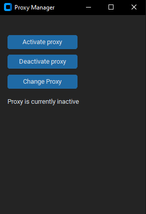

# ProxySetter
My project is open to all contributions, so feel free to fork and make a pull request.
## How to use 
Clone this repository

Install the dependencies: pip install -r requirements.txt

Run the following command: py main.py

If you want to use it without the GUI Run: python cli.py 

### Arguments
-status or -s: Check the current proxy status

-activate or -a: Activate the proxy

-deactivate or -d: Deactivate the proxy

-change or -c: Change the proxy address (must specify the new address as an additional argument, e.g. setproxy -c newproxy:8080)

-show: Show the current proxy address

-help or -h: Show the help message

Note: If an invalid argument is provided, the program will display an error messag
## Preview

### TODO
- [x] GUI

